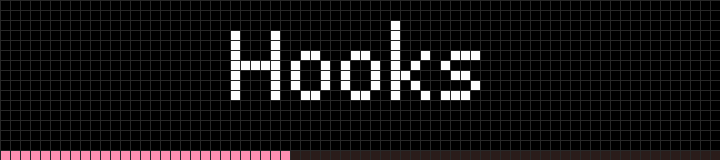
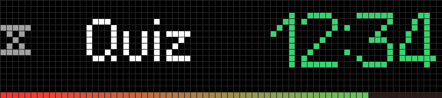
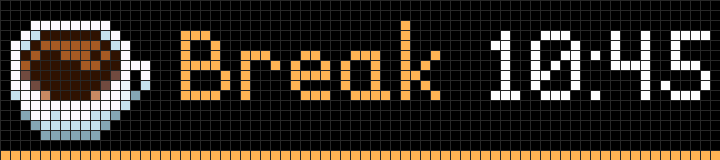
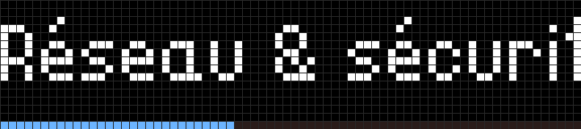
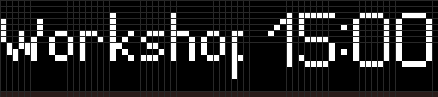
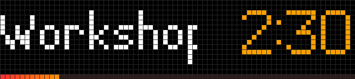
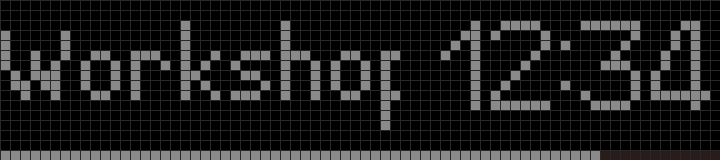
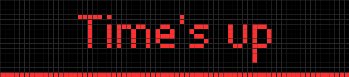
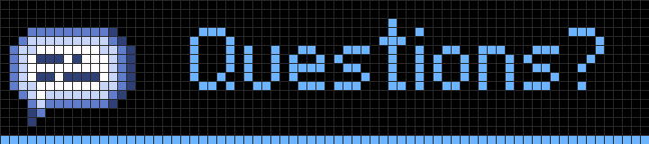
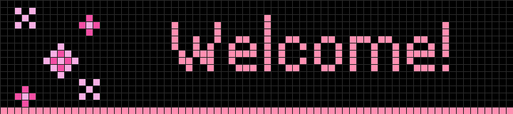

# slidev-addon-busybar

Turn a [BUSY Bar](https://busy.app) facing the room into a companion for your
[Slidev](https://sli.dev) talks and trainings: it follows your slides on its
own.

- **Current chapter** and how far you are in it, in a colour per chapter
- **Workshop timers** you start from your presentation remote: green, then
  orange, then red, then a blinking "Time's up", a sound and the status LED
- **Special screens**: break (with the resume time), questions, welcome, your
  own logos
- Accented text, long titles scrolling, English and French built in





> [!IMPORTANT]
> Unofficial community project, not affiliated with or endorsed by Flipper
> Devices. "BUSY Bar" is their trademark.

## Your talk never depends on the bar

The addon only runs with `slidev` (the dev server). `slidev build` and
`slidev export` never talk to the bar. Unplugged, asleep or slow, the bar
never holds your slides back: every call has a 1.5 s timeout, the slides
never wait for it, and the console says so once, then retries every 5 seconds:

```
[busybar] BUSY Bar unreachable (fetch failed). The talk goes on without it; retrying every 5 s.
[busybar] BUSY Bar reachable again.
```

Nothing is sent anywhere but to the bar: no BUSY cloud.

## Install

```bash
npm install slidev-addon-busybar
```

```yaml
---
# slides.md headmatter
addons:
  - busybar
---
```

### Connect the bar

1. **Set the switch on the bar to APPS.** In the other positions the bar
   refuses to draw anything from outside (a 409 error in the console).
2. **Connect it**, either:
   - over **USB**: nothing to configure, it answers on `10.0.4.20`;
   - over **Wi-Fi**: you need its IP address (shown in the BUSY app) and its
     HTTP access code (the bar's "HTTP Access" setting, in key mode). A token
     from the BUSY cloud will not work here.
3. **Create `.env.local`** next to your deck (start from
   [`.env.example`](.env.example)) and **git-ignore it**. It stays on your
   machine and is never sent to the browser. The addon reads it from the folder
   you run `slidev` in and from the deck's folder; shell variables win:

   ```bash
   BUSYBAR_ADDR=192.168.1.42    # default: 10.0.4.20 (USB)
   BUSYBAR_PASSWORD=123456      # HTTP access code, needed over Wi-Fi
   ```

   | Variable | Purpose |
   |---|---|
   | `BUSYBAR_ADDR` | address of the bar; `10.0.4.20` by default |
   | `BUSYBAR_PASSWORD` | HTTP access code of the bar |
   | `BUSYBAR_ENABLED` | `false` turns the addon off |
   | `BUSYBAR_SOUND` | end-of-timer sound; empty for none. Default: `shared/calendar_reminder_ends.wav` |
   | `BUSYBAR_DEBUG` | `true` logs every call to the bar |

4. Run `slidev`: the console shows `[busybar] relay to …`.

## Annotate your slides

Everything goes in a `busy` block of the frontmatter.

**A chapter** is declared on its first slide only, and lasts until the next
chapter or special screen. The bar shows its title (scrolling if too long)
and, on its last row, where the slide sits in the chapter. Outside any chapter
(section slides…), it shows the slide's title.

```yaml
---
busy:
  chapter: Hooks
---
```



**A timed activity** shows its name and length **without starting**: you start
it (see [shortcuts](#shortcuts)). Durations: `90s`, `15m`, `1h30m`.

```yaml
---
busy:
  activity: Workshop 1
  timer: 15m
---
```



Once started, the timer lives on its own: it keeps running when you change
slides, backwards included, and stays on the bar until it ends or you cancel
it. It turns orange under 20 % of the time and red under a minute, the last
row drains from green to red, and an hourglass precedes the name when there is
room. At zero the bar plays a sound, blinks "Time's up" in red and so does its
status LED. Changing slide or pressing `b` dismisses it.





**A special screen**: `pause`, `questions` or `welcome`, each with its icon and
colour, or the name of one of your [logos](#logos). `until` adds the resume
time, `text` replaces the title; any other name is shown as is.

```yaml
---
busy:
  screen: pause
  until: "10:45"
---
```




A screen takes precedence over the chapter and over a running timer (which
keeps running and comes back afterwards). Only the end of a timer takes
precedence over a screen.

### Shortcuts

| Key | Effect |
|---|---|
| `b` or `.` | start the slide's activity, pause, resume; dismiss "Time's up" |
| `+` or `=` | one more minute (a finished timer too) |
| `Shift` + `x` | cancel the timer |

`b` and `.` are what the "blank screen" button of presentation remotes sends:
one button runs the whole timer. Shortcuts work in whichever window has the
focus, audience or presenter.

## Configure

Everything has a default. To change it, add `busybar.config.ts` next to
`slides.md`; it is reloaded when you save it.

```ts
import { defineConfig } from 'slidev-addon-busybar'

export default defineConfig({
  locale: 'fr', // 'en' (default) or 'fr'
  labels: { timeUp: 'Terminé !' },
  chapterColors: ['#D3A5AA', '#7BBADD', '#B25043'],
  screens: {
    pause: { title: 'Déjeuner' },
    demo: { title: 'Démo live', color: '#7DDB8B', icon: 'dt_work' },
  },
})
```

Colours read best saturated: dark or greyish tones look dull on LEDs.

### Logos

A logo is a function returning `DisplayDraw` elements for the 72×16 screen,
shown by `busy.screen: <name>`. The package exports small helpers:

```ts
import { defineConfig, label, pixels, rect, SCREEN, textWidth } from 'slidev-addon-busybar'

export default defineConfig({
  logos: {
    acme: () => [
      pixels('heart', ['.##.##.', '#######', '.#####.', '..###..', '...#...'], { '#': '#FF5A7A' }, 8, 5),
      label('word', 'acme', 'bold', '#FFFFFF', 20, 3),
    ],
  },
})
```

- `pixels(id, grid, palette, x, y)`: pixel art, one character per pixel, `.`
  transparent, up to 32 colours
- `rect(id, x, y, width, height, color)`: a filled rectangle
- `label(id, text, font, color, x, y)`: text in one of the bar's fonts (`tiny`,
  `small`, `normal`, `condensed`, `bold`, `large`, `extra_large`, `global`)
- `textWidth(text, font)` and `SCREEN` to lay things out

[`example/busybar.config.ts`](example/busybar.config.ts) has a complete one.

### Firmware icons

`screens.<name>.icon` takes the name of an image stored on the bar, such as
`dt_coffee`, `dt_tea`, `dt_dialog`, `dt_book`, `dt_work`, `dt_home`,
`dt_sparkls_1`, `dt_heart_red`, `dt_emoji_happy`. The full list of your bar:
`GET /api/storage/list?path=/ext/apps_assets/shared/images`.

## Troubleshooting

- **409 in the console**: the switch on the bar is not on APPS.
- **403**: `BUSYBAR_PASSWORD` missing or wrong.
- **Shortcuts do nothing** while the bar follows the slides: the browser
  cached a version of the shortcuts from before the addon was installed. Clear
  the site data of `localhost:3030` once (DevTools → Application → Storage →
  Clear site data).
- **See what goes to the bar**: `BUSYBAR_DEBUG=true slidev`.

## What we learnt about the bar

Tested on firmware 1.2.4 (API 27.5.0). None of it is in the official docs:

- Only the `global` font has accented letters; the others show boxes. Its
  capitals are drawn without their accent.
- The native `countdown` element uses a fixed 5-pixel font, unreadable from
  the back of a room: the addon draws the time itself, once per second.
- A `DisplayDraw` adds to the application's elements instead of replacing
  them; an element drawn again under the same `id` is replaced.
- A rectangle without an explicit `z_index` placed after a text element is
  drawn over rectangles with a higher `z_index`.
- Firmware images and animations are addressed as
  `shared/images/<name>.image` and `shared/animations/<name>.anim`.
- `led_notification_color` on a draw blinks the status LED; the next draw
  without it stops it.

## How it works

`global-bottom.vue` works out, in the browser, the chapter and progress of the
current slide and posts them to the dev server (`POST /__busy/slide`). A Vite
plugin (`src/plugin.ts`) receives them, ignores duplicates (audience and
presenter windows send the same slide) and hands them to the relay, which
draws on the bar with [`@busy-app/busy-lib`](https://github.com/busy-app/busylib-ts):
one call in flight at a time, only what changed.

## Develop

```bash
npm install
npm test          # renderer, relay and timer, no bar needed (Node ≥ 23.6)
npm run dev       # builds, then opens example/slides.md
npm run preview -- /tmp/screens   # draws every state on a real bar and saves screenshots
```

`npm run dev` and `npm run preview` read the bar's address and code from
`.env.local` at the root of the repository: `cp .env.example .env.local`, then
fill it in.

## Roadmap

- [ ] Break and welcome screens counting down to `until`
- [ ] Presenter dashboard on the back screen (clock, next chapter, timer)
- [ ] Ahead/behind schedule
- [ ] Phone remote
- [ ] Timer control from the bar's buttons
- [ ] Reactions (hearts, sparkles)
- [ ] Configurable shortcuts, more locales, custom end sound
- [ ] Logos from a PNG
- [ ] Verify USB on hardware
- [ ] Integration tests against the emulator, release workflow

## License

[MIT](LICENSE)
